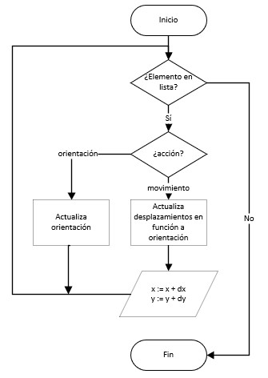
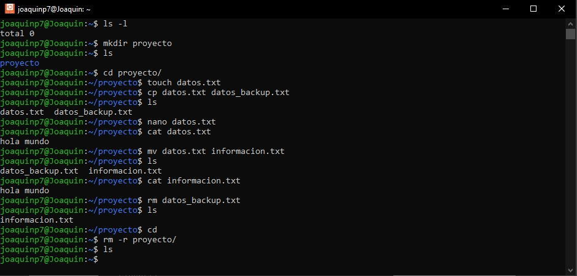

# Ejercicio 1 

1. Debido a que se presentan 4 casos válidos para realizar la acción, se optó por la implementación de la estructura if, considerando además un caso extra para otros caracteres ingresados. Por otro lado, debido a que debe funcionar para mayúsculas y minúsculas, se utilizó el método `lower()`. Así, en caso se ingrese 'W', el sistema lo recibirá 'w'. De esta manera, se ahorra ingresar `if(acc == 'w') or (acc = 'W'):
```
# Salidas:
> Ingrese el movimiento a realizar: d
Carrito gira a la derecha
> Ingrese el movimiento a realizar: W
Carrito avanza
> Ingrese el movimiento a realizar: j
Dirección no válida 
```

2. Se define la clase _robot_movement_, en este caso la lógica es la misma, solo se debe adaptar lo realizado en 1., especificamente en la acción de `print()`  
Al escribir `rob.avanzar()`, se invoca el método `avanzar()` del objeto `rob` de clase _robot_movement_. Este método invoca al otro método `__movement`, que justamente imprime la acción a realizar.
```
# Salidas:
> Ingrese el movimiento a realizar: A
robot "carrito" está girando a la izquierda
> Ingrese el movimiento a realizar: s
robot "carrito" está retrocediendo
> Ingrese el movimiento a realizar: wa
robot "carrito" está detenido
```

3. Para esta última actividad, el programa se debe realizar de forma indefinida hasta que se ingrese '0', por lo que la mejor opción es realiza un bucle.
Se prefirio implementar un _while True: Break_ debido a que se buscó simular una estructura do-while, ya que en Py no existe específicamente; por otro lado, la otra opción pudo ser de esta forma: 
```
accion inicial en Do
while(centinela):
  acciones en Do
```
Es decir, un caso inicial y luego el While-Do; sin embargo, la repetición del caso inicial me decantó por utilizar _while True: Break_.  
Un aspecto más por agregar es, que con el objetivo de reciclar código, se implementó el código en 2. dentro de la clase robot_movement. De esta manera, el código principal se simplificó.
```
#Salidas:
>Ingrese el movimiento a realizar: W
robot "carrito" está avanzando
>Ingrese el movimiento a realizar: S
robot "carrito" está retrocediendo
>Ingrese el movimiento a realizar: A
robot "carrito" está girando a la izquierda
>Ingrese el movimiento a realizar: D
robot "carrito" está girando a la derecha
>Ingrese el movimiento a realizar: w
robot "carrito" está avanzando
>Ingrese el movimiento a realizar: d
robot "carrito" está girando a la derecha
>Ingrese el movimiento a realizar: f
robot "carrito" está detenido
>Ingrese el movimiento a realizar: a
robot "carrito" está girando a la izquierda
>Ingrese el movimiento a realizar: s
robot "carrito" está retrocediendo
>Ingrese el movimiento a realizar: sa
robot "carrito" está detenido
>Ingrese el movimiento a realizar: 0
Fin del programa
```

# Ejercicio 2

1. Hay varios aspecto a considerar en la solución de este problema. En primer lugar, se declara una variable adicional a la posición: la **orientación** que se denota como _ang_. Esta también se inicializa a 0. La explicación del por qué el inicial es 0 se explicará más adelante.  
El procedimiento a realizar se refleja en este diagrama de flujo:

<div align="center">
  


</div>

Se analiza cada acciones de la lista, dependiendo de si es movimiento o rotación actualiza desplazamientos u orientación, y se repite hasta acabar con todas las acciones, donde imprime el resultado.


Otro aspecto a analizar es la relación de orientación con desplazamiento. Cada una de las orientaciones fue analizada como un ángulo (adelante: 0°, atrás: 180°, izquierda: 90°, derecha 270°), como se observa en la figura.

<div align="center">
  


</div>

La importancia de los ángulos es que simplifica de una manera eficaz la transformación a desplazamientos. Como podemos ver en la Tabla 1, si un carro desea avanzar estando en la posición _adelante_, su coordenada x se mantendrá, mientras que y aumentará una unidad. Este desplazamiento (0,1) es **el mismo** que si aplicamos (sin(90), cos(90)). Y esta relación cumple con todas las otras combinaciones. Por otro lado, para la acción de retroceder, solo hay que negar los datos.

<div align="center">

|    | x | y |
|----|---|---|
| 0° | 0  | 1  |
| 90°| -1 | 0  |
| 180°| 0 |-1  |
| 270°| 1 | 0  |

Tabla 1: Desplazamientos del robot dependiendo de la orientación (Caso: robot avanza)

</div>

Por otro lado, cuando exista un cambio de orientación mediante las instrucciones 'giro_izquierda' o 'giro_derecha', se realiza de esta manera. Ya que los ángulos aumentan de forma antihoraria, cuando exista un giro_izquierda, el ángulo aumentará en 90°. En el caso que este aumente de 270° a 360°, el operador de residuo permitirá que vuelva a ser 0° y se puede repetir el ciclo. En cambio, cuando existe un giro horario, normalmente se debería restar 90°; sin embargo, para mantener los datos positivos, se debe sumar 270° (-90 + 360° = 270°). Finalmente, se busca el residuo de ese resultado con 360 para no salir del rango de una vuelta y poder repetir el ciclo.

Mediante la aplicación de estos conceptos, se puede realizar el programa.

```
""" Código a ejecutar
x,y = (0,0)
ang = 0
cmds = ['avanza']
print(simular_movimiento(cmds))
cmds = ['giro_derecha', 'avanza']
print(simular_movimiento(cmds))
cmds = ['giro_izquierda', 'retrocede']
print(simular_movimiento(cmds))
"""
# Salidas:
> snippet_ej2.py
x,y = (0,1)
x,y = (1,1)
x,y = (1,0)
```

2. La lógica es la misma que en el primer inciso, solo se debe agregar restricciones a posiciones máximas y mínimas de los ejes, y asignar un nombre de cadena al ángulo de orientación, simbolizado en la variable heading.

```
""" Código a ejecutar
cmds = ['giro_izquierda', 'retrocede', 'retrocede', 'giro_derecha', 'avanza', 'avanza', 'avanza','avanza', 'giro_derecha', 'avanza','giro_izquierda','retrocede']
x,y,heading = simular_movimiento(cmds)
display_game(' ', 7, *(x,y,heading))
"""
# Salidas:
> snippet_ej3.py

  | 0 | 1 | 2 | 3 | 4 | 5 | 6 | 
--------------------------------
6 |   |   |   |   |   |   |   | 
--------------------------------
5 |   |   |   |   |   |   |   | 
--------------------------------
4 |   |   |   |   |   |   |   | 
--------------------------------
3 |   |   |   | ↑ |   |   |   | 
--------------------------------
2 |   |   |   |   |   |   |   | 
--------------------------------
1 |   |   |   |   |   |   |   | 
--------------------------------
0 |   |   |   |   |   |   |   | 
--------------------------------
```

# Ejercicio 3

1. Desarrollar una función calcular_CRC que reciba una cadena de texto en formato NMEA y calcule el CRC de la trama.  
En primer lugar, se debe solo extraer el texto entre los caracteres '\$' y '\*'. El método a utilizar fue obtener los índices de encuentro de cada caracter y mediante slicing, extraer el texto deseado. Otra opción pudo haber sido simplemente suponer que el número de caracteres antes de '\$' y después de '\*' sean siempre los mismos y hacer slicing con valores constantes.  
Después de esto, se obtiene la secuencia de bytes del texto usando el método `encode()` y se realiza la función lógica XOR entre todos los bytes. Finalmente, ya que la respuesta obtenida de las operaciones se encuentra en base 10, se transforma a hexadecimal usando `hex()`, la cual entrega una cadena de forma _0xABC_; por esta razón, mediante slicing solo extraemos el valor _ABC_, que es lo que devuelve la función.
```
> data = "$PGPSP,250472200,2140,197396,-12.06866870,-77.07954170,93.68,84.76,1.32,1.57,3.26,-0.03,0.19,0.06,0.46,29.0,249603.8609,18*5d"
> print(calcular_CRC(data))
5d
```

2. En vez de regresar el CRC del dato ingresado, se debe extraer el CRC que el dato de entrada nos proporciona para comparar. En caso el crc de la entrada y el calculado sean iguales, se devuelve True. Caso contrario, se devuelve False.
```
> data = "$PGPSP,250471600,2140,197396,-12.06866810,-77.07954220,93.42,84.51,1.32,1.58,3.25,-0.04,0.27,0.05,0.47,28.4,249603.8609,18*56"
> print(validar_CRC(data))
True
```

3. Se utiliza la misma lógica de 1. y 2., pero con adiciones. Al recibir ahora una lista en vez de un dato, se debe utilizar `for data in list:` para recorrer cada dato. Por otro lado, se debe realizar acciones dependiendo de si el crc calculado y de entrada sean iguales.  
En caso sean iguales, se deben obtener los valores de latitud y longitud. El procedimiento se basó en obtener los índices de las comas repetidas por cuarta, quinta y sexta vez, debido a que los valores se encuentran entre esta posición de comas siempre, por lo que basta usar slicing para extraer la latitud y longitud. Estos valores son ingresados en una tupla y mediante `append()` se ingresa en una lista.  
Cuando son diferentes, y para no variar el flujo de trabajo para un analista de datos (debido a que esto probablemente sea transformado en una tabla posteriormente) se decidió que cuando la comunicación sea errónea, se asignarán los valores de 999 tanto a latitud como longitud. Los rango de estas magnitudes van de [-90 90] y [-180 180] respectivamente; por esta razón, un valor erróneo podrá ser fácilmente limpiado.

```
>data = [
        '$PGPSP,250668200,2140,66323,-12.06820620,-77.07969190,89.15,80.23,1.40,1.44,2.38,-0.13,-0.05,0.32,0.26,29.7,249603.8584,18*41',
        '$PGPSP,250667600,2140,66323,-12.06820810,-77.07969150,89.20,80.28,1.40,1.46,2.40,-0.05,-0.24,0.27,0.41,26.8,249603.8584,18*4a',
        '$PGPSP,250668200,2140,66323,-12.06820620,-77.07969190,07776.000,2931767.500,1312.233*3d',
        '$PGPSP,250674200,2140,66324,-12.06818590,-77.07969470,88.89,79.97,1.27,1.53,2.45,-0.24,-0.10,0.47,0.39,28.9,249603.8583,18*40',
        '$PGPSP,250674600,2140,66323,-12.06818550,-77.07969470,88.83,79.91,1.34,1.53,2.44,-0.05,0.07,0.06,0.40,28.3,249603.8583,18*6e',
        '$PGPSP,250675200,2140,66324,-12.06818560,-77.07969460,88.74,79.82,1.27,1.53,2.45,-0.08,0.06,0.09,0.47,27.9,249603.8583,18*66',
        '$PGPSP,250675600,2140,66324,-12.06818560,-77.07969430,88.72,79.81,1.27,1.54,2.45,-0.01,0.04,0.01,0.43,27.7,249603.8583,18*6c',
        '$PGPSP,250676200,2140,66324,-12.06818580,-77.07969420,88.68,79.76,1.27,,-0.0011,0.0036,-1.0709,0.216,0.016,-0.007,-12.06820697,-77.07971314,96.367,-5807775.000,2931767.500,1312.199*1b',
        '$PGPSP,250680200,2140,197396,-12.06818480,-77.07969730,89.23,80.31,1.27,1.49,2.20,0.06,0.07,0.03,0.40,30.5,249603.8583,18*73',
        '$PGPSP,250680800,2140,197396,-12.06818470,-77.07969760,89.28,80.36,1.27,1.49,2.18,-0.12,0.08,0.02,0.48,30.3,249603.8582,18*5d',
        '$PGPSP,250681200,2140,197396,-12.06818470,-77.07969780,89.30,80.38,1.27,1.49,2.17,0.15,0.10,0.01,0.49,30.3,249603.8582,18*71',
        '$PGPSP,250681600,2140,197396,-12.06818510,-77.07969770,89.37,80.45,1.27,1.49,2.16,-0.04,0.07,-0.03,0.38,30.0,249603.8582,18*70'
]
>latlong = extract_data(data)
>print(latlong)
[(-12.0682062, -77.0796919), (-12.0682081, -77.0796915), (999, 999), (999, 999), (-12.0681855, -77.0796947), (-12.0681856, -77.0796946), (-12.0681856, -77.0796943), (999, 999), (-12.0681848, -77.0796973), (-12.0681847, -77.0796976), (-12.0681847, -77.0796978), (-12.0681851, -77.0796977)]

```

# Ejercicio 4

### Comandos utilizados en el programa

1. ls -l: Verifica que el directorio en el que se trabajará no contiene directorios llamados proyecto/
2. mkdir proyecto: Se crea el directorio proyecto
3. cd proyecto/: Se traslada a la ruta proyect/
4. touch datos.txt: Se crea en proyecto/ un documento de texto llamado datos.txt
5. cp datos.txt datos_backup.txt: Se crea una copia del documento llamada datos_backup.txt
6. ls: Se observan los nuevos archivos
7. nano datos.txt: Se modifica el archivo datos.txt y se ingresa "Hola Mundo"
8. cat datos.txt: Se observa el contenido de datos.txt ("Hola mundo")
9. mv datos.txt informacion.txt: Además de mover datos, `mv` también puede cambiar el nombre de un archivo si el segundo argumento se encuentra en el mismo directorio. Aquí se cambia el nombre de datos.txt a informacion.txt
10. ls: Se observa el cambio
11. cat información.txt: Se comprueba que el contenido de informacion.txt es el mismo que el antiguo datos.txt(Salida: "Hola mundo")
12. rm datos_backup.txt: Se borra el archivo datos_backup.txt
13. ls: Se observa el cambio
14. cd: Se regresa a la ruta predeterminada
15. rm -r proyecto/: Se borra el directorio proyecto, con todos sus archivos
16. ls: Se observa el cambio

### Programa


